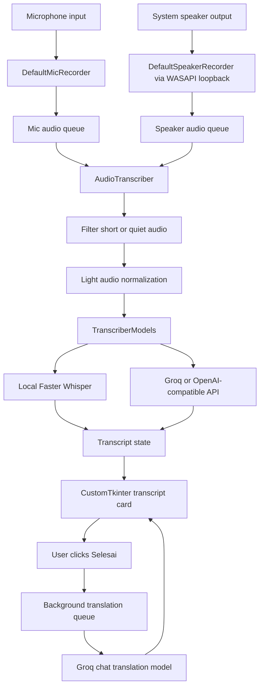
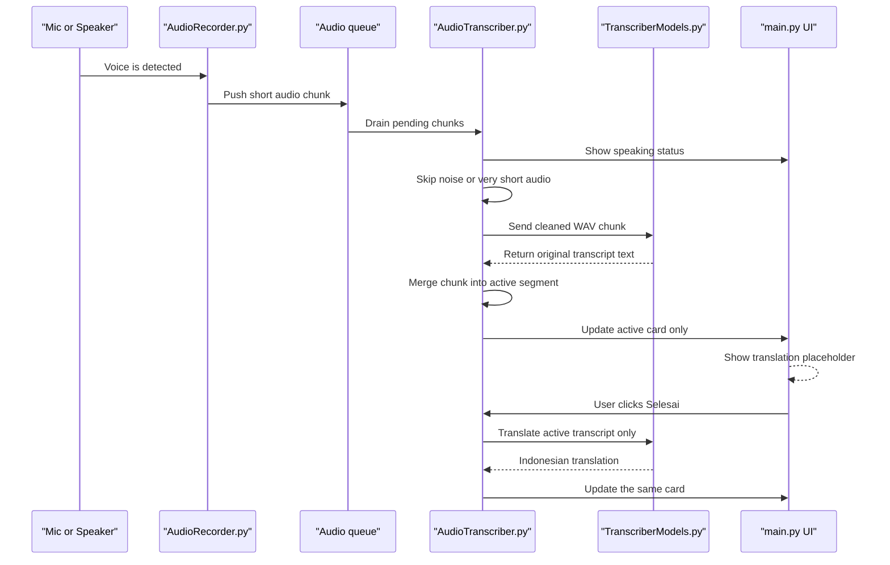
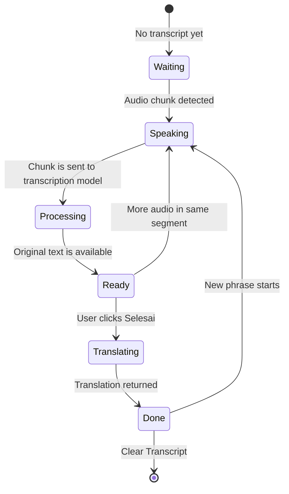

# realtime-dual-transcriber

realtime-dual-transcriber is a Windows desktop application for live transcription from two audio sources at the same time:

- microphone input, shown as `You`
- system speaker output, shown as `Speaker`

The application displays a real-time transcript in a desktop UI and can optionally use an OpenAI-compatible API provider such as Groq for faster multilingual transcription and Indonesian translation.

## Key Features

- Dual-source transcription for microphone and speaker audio
- Desktop interface built with CustomTkinter
- WASAPI loopback support for capturing default speaker output on Windows
- Local transcription mode with Faster Whisper
- API transcription mode with Groq or another OpenAI-compatible endpoint
- Optional Indonesian translation for each finalized transcript block
- Configurable fast/accurate transcription mode, language, prompt context, phrase timeout, audio filtering, and UI refresh
- Secret-safe local configuration through `.env` or `keys.py`
- Built-in unit tests for transcript state and API authentication handling

## Repository

```powershell
git clone https://github.com/Diyoncrz18/realtime-dual-transcriber.git
cd realtime-dual-transcriber
```

## Requirements

- Windows 10 or Windows 11
- Python 3.8 or newer
- FFmpeg available on `PATH`
- Working microphone and default speaker device
- Optional: Groq or OpenAI-compatible API key for API mode

Install FFmpeg with Chocolatey:

```powershell
choco install ffmpeg
```

Or install FFmpeg manually and make sure `ffmpeg.exe` is available from PowerShell:

```powershell
ffmpeg -version
```

## Installation

Create and activate a virtual environment:

```powershell
python -m venv .venv
.\.venv\Scripts\Activate.ps1
```

Install dependencies:

```powershell
python -m pip install --upgrade pip
pip install -r requirements.txt
```

## Configuration

The recommended configuration method is `.env`.

```powershell
Copy-Item .env.example .env
```

Edit `.env` and replace placeholder values with your own credentials.

Groq example:

```env
GROQ_API_KEY=your-groq-api-key-here
GROQ_TRANSCRIPTION_MODEL=whisper-large-v3-turbo
GROQ_TRANSLATION_MODEL=llama-3.1-8b-instant
```

For mode-based model selection, set:

```env
RTDT_TRANSCRIPTION_MODE=fast
```

Use `fast` for lower latency (`whisper-large-v3-turbo`) or `accurate` for better accuracy (`whisper-large-v3`).
When `RTDT_TRANSCRIPTION_MODE` is set, it selects the Groq transcription model. Without it, an explicit `GROQ_TRANSCRIPTION_MODEL` value is used.

OpenAI-compatible endpoint example:

```env
OPENAI_API_KEY=your-openai-compatible-api-key
OPENAI_BASE_URL=https://your-provider.example/v1
OPENAI_TRANSCRIPTION_MODEL=whisper-1
```

You can also configure credentials through `keys.py`:

```powershell
Copy-Item keys.example.py keys.py
```

Keep real credentials local. `.env` and `keys.py` are ignored by Git and should never be committed.

## Runtime Tuning

These values are optional and can be added to `.env` when needed:

```env
RTDT_TRANSCRIPTION_MODE=fast
RTDT_TRANSCRIPTION_LANGUAGE=en
RTDT_TRANSCRIPTION_TEMPERATURE=0
RTDT_TRANSCRIPTION_PROMPT=This is an English motivational speech. Common words: power of words, adversity, opportunity, weakness, strength, disabled, differently abled, disability.

RTDT_RECORD_TIMEOUT=1.0
RTDT_PHRASE_TIMEOUT=3.0
RTDT_PAUSE_THRESHOLD=0.50
RTDT_MIN_AUDIO_SECONDS=0.30
RTDT_MIN_AUDIO_RMS=120
RTDT_MIN_MIC_RMS=120
RTDT_MIN_SPEAKER_RMS=90
RTDT_ENABLE_AUDIO_NORMALIZATION=1
RTDT_TARGET_AUDIO_RMS=800
RTDT_PRIORITIZE_SPEAKER=1
RTDT_UI_REFRESH_MS=150
RTDT_PROCESSING_STATUS_DELAY=0.15
```

Model recommendation:

- `whisper-large-v3-turbo` for lower latency
- `whisper-large-v3` for higher accuracy

Set `RTDT_TRANSCRIPTION_LANGUAGE=auto` to let the provider detect the language. For English video/audio, prefer `en` or `auto`; do not force `id` unless the source audio is Indonesian.

## Running the Application

Run local transcription mode:

```powershell
.\.venv\Scripts\python.exe main.py
```

Run API transcription mode:

```powershell
.\.venv\Scripts\python.exe main.py --api
```

API mode is recommended when you need better multilingual support, faster transcription, and Indonesian translation.

## Documentation

### System Flow



### Realtime Transcript Flow



### UI State Flow



## How It Works

1. `AudioRecorder.py` captures microphone audio and default speaker loopback audio.
2. `AudioTranscriber.py` filters short or silent audio, merges phrase fragments, and manages transcript state.
3. `TranscriberModels.py` routes transcription to either Faster Whisper or an OpenAI-compatible API provider.
4. `main.py` renders the live transcript UI and refreshes it as transcript revisions change.

## Project Structure

```text
.
|-- AudioRecorder.py              # Microphone and speaker recording
|-- AudioTranscriber.py           # Transcript state, merging, filtering, translation queue
|-- TranscriberModels.py          # Local and API transcription providers
|-- main.py                       # Desktop UI entry point
|-- custom_speech_recognition/    # Speech recognition compatibility layer
|-- tests/                        # Unit tests
|-- .env.example                  # Environment variable template
|-- keys.example.py               # Python credential template
|-- requirements.txt              # Python dependencies
`-- README.md                     # Project documentation
```

## Testing

Run the unit test suite:

```powershell
.\.venv\Scripts\python.exe -m unittest discover -s tests
```

Compile-check the main Python files:

```powershell
.\.venv\Scripts\python.exe -m py_compile main.py AudioRecorder.py AudioTranscriber.py TranscriberModels.py
```

## Troubleshooting

### Invalid or expired API key

If the terminal shows `Invalid API Key` or `expired_api_key`, create a new provider key, update `.env` or `keys.py`, and restart the application.

### FFmpeg not found

Make sure FFmpeg is installed and available from PowerShell:

```powershell
ffmpeg -version
```

### Speaker audio is not captured

The application captures the default Windows speaker output through WASAPI loopback. Set the target output device as the Windows default speaker before starting the app.

### Translation is delayed

Translation runs when you click the `Selesai` button. While speaking, the active transcript block keeps updating and the translation field waits for that manual finish action.

## Security Notes

- Do not commit `.env`, `keys.py`, model files, recordings, or logs.
- The repository includes a GitHub Actions secret scan for common API key patterns.
- If a real API key was ever committed, revoke it immediately and create a new one.

## Maintainer

Maintained by `Diyoncrz18`.
